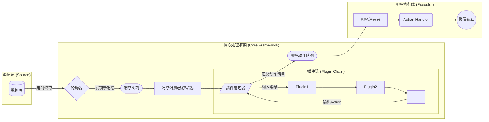

# omni-bot-sdk

> ⚠️ **使用风险警告**
>
> 使用本项目存在微信账号被封禁、功能受限等风险，**项目及作者概不承担任何责任**。
>
> **🫸强烈建议不要使用任何在线 LLM API（如 OpenAI、百度、讯飞等）以免造成个人信息泄漏。**
>
> 在使用过程中，请务必遵守微信的各项行为准则，避免违规操作，降低封号概率。
>
> ---
>
> **🙅‍♂️禁止使用范围：**
>
> 本项目**严禁用于营销、发广告等任何企业或商业行为**，仅推荐用于个人学习和技术交流用途。
>
> **☂️隐私与安全声明：**
>
> 本项目**不联网，不收集任何用户数据**，所有运行数据均保留在用户电脑本地。
>
> 本项目**不会对微信数据库进行任何写操作**，不影响微信的正常运行。

<p align="center">
  <a href="https://github.com/weixin-omni/omni-bot-sdk-oss">
    
  </a>
  <a href="LICENSE">
    
  </a>
  <a href="https://pypi.org/project/omni-bot-sdk">
    
  </a>
</p>

<p align="center">
  
</p>

> 🤖👁️🖥️ 一个基于视觉识别，运行时零侵入的微信4.0 RPA 框架，构建个微聊天机器人，快速接入LLM,Dify

<p align="center">
  <kbd></kbd>
</p>

## ✨ 特性

* **接收消息零延迟**：基于数据库的监听策略，几乎零延迟接收消息
* **运行时零侵入**：采用特殊训练的YOLO模型 + OCR识别定位策略，对微信程序零HOOK，降低被检测概率
* **MCP Tool**: 支持mcp调用rpa，和微信进行交互，发送消息，群管理操作等
* **RPA可扩展**：可轻松自定义RPA扩展，支持更多的动作，包括 发送朋友圈，发送小程序等
* **插件化架构**：通过插件系统轻松扩展你的机器人功能，保持主逻辑清晰。
* **理论支持最新版本微信**：基于视觉识别的RPA，几乎不受微信版本更新影响
* **快速启动**：几行代码，即可启动一个RPA机器人
* **异常自恢复**: 微信异常的情况下尝试自动回复RPA，失败自动推送钉钉登录二维码

## 🚀 快速开始

注意，基于RPA方案，在运行时，请勿操作鼠标键盘，以免影响RPA运行


### 1. 安装

**务必使用Python3.12**

通过 pip 从 PyPI 安装：

```bash
pip install omni-bot-sdk
```

### 2. 获取数据库密钥

**本项目不提供此工具，可自行通过github获取 DbkeyHookCMD.exe或者DbkeyHookUI.exe进行获取
获取数据库密钥后，填入配置文件中的 dbkey，请查阅鸣谢章节获取**

### 3. 启动MQTT服务

mqtt服务用于MCP消息转发，以及后续更新任务执行结果回调，windows可以使用nanomq直接启动本地服务

### 4. "Hello, World"

**🔎🔑注意：重新启动一次微信，并登录，然后立即启动RPA，否则可能无法获取图片解密密钥，微信会在启动后一段时间污染密钥，RPA启动后会自动给文件传输助手发送一张图片，然后执行获取密钥**

参考 config.example，生成 config.yaml ，然后几行代码即可启动RPA

```python
from omni_bot_sdk.bot import Bot

def main():
    bot = Bot(config_path="config.yaml")
    bot.start()

if __name__ == "__main__":
    main()
```

现在，去和你的机器人聊天吧！

## 🖥️ 桌面版 GUI 客户端

如果您喜欢直接使用桌面版应用程序，我们为您准备了一个可视化管理客户端，无需编写代码即可轻松上手。

👉 [前往 omni-bot-gui 仓库](https://github.com/weixin-omni/omni-bot-gui)

## 项目架构



## 📚 插件文档

想要了解更多高级用法和完整的 API 参考吗？

👉 **请查阅我们的 [插件仓库](https://github.com/weixin-omni/omni-bot-plugins-oss)** 👈

内置了两个插件

* 自己发送的消息阻断，不再触发后续的插件处理
* 没有群名称的消息阻断，目前无法处理这类消息

## 🧩 示例

我们提供了一个包含丰富示例的目录，帮助你快速实现各种功能。

你可以在本仓库的 `examples/` 目录下找到所有示例代码。

## 🤝 贡献

我们热烈欢迎任何形式的贡献！无论是提交 Issue、修复 Bug 还是添加新功能。

在开始之前，请先阅读我们的 **[贡献指南 (CONTRIBUTING.md)](CONTRIBUTING.md)**。

开发环境设置：

```bash
# 1. 克隆仓库
git clone https://github.com/weixin-omni/omni-bot-sdk-oss
cd omni-bot-sdk-oss

# 2. 创建并激活虚拟环境 (推荐)
python -m venv venv
source venv/bin/activate # on Windows: venv\Scripts\activate

# 3. 安装开发依赖
pip install -e .

```

## 💀 项目局限性

* RPA操作基于文字识别和YOLO识别，无法保证100%准确以及操作的100%成功，鲁棒性不如接口逆向或Hook的框架
* 消息发送需要指定联系人，采用和人类操作完全相同的策略，当出现同名的联系人或者群聊时，无法准确找到目标对话，导致操作失败或错误
* RPA操作不能打断，由于RPA操作必须是线性的，因此RPA框架运行时，会和用户抢夺鼠标键盘的操控权，最佳情况是在单独的机器上进行部署
* 窗口不能准确获取，虽然已经采取了一部分措施来防止获取到错误的窗口，但是目前不能保证100%，如果有同名的窗口标题，可能导致错误的窗口焦点
* 初始化流程长，由于RPA初始化需要对不同的控件进行定位，因此需要花费一点时间，这是正常的。完全采用视觉定位，无法避免。
* 数据获取方案可被检测，目前采用数据库轮询的方案获取最新消息，使用只读模式打开微信的db文件，会出现文件句柄，具体表现和杀毒软件扫描文件应该是类似的。后续会优化，在不读取的时候释放掉句柄。

## ❓FAQ

可以加Omni-bot的开发者交流群，请注明omni-bot，机器人会自动通过，每天自动通过人数有限，请耐心等待

<p align="center">
    
    
</p>

（如果项目对你有用，也可以请我喝杯咖啡 ☕️ ~）

<p align="center">
  <kbd></kbd>
</p>

## 🗺️ 路线图 (Roadmap)

我们对项目的未来有一些规划，欢迎你加入讨论或贡献代码！

* [ ] 更换图片解析的方式，支持WXGF解析 [图片解析项目](https://github.com/recarto404/WxDatDecrypt)
* [ ] 优化消息获取机制，增强反屏蔽能力
* [ ] 增强鲁棒性，对于视觉识别异常调用VL模型进一步处理
* [ ] 增加更多免费插件
* [ ] 一个更加完善的GUI客户端（目前有一个简化版）
* [ ] 编写测试用例（嘿嘿嘿嘿嘿，这一条就先看看）

## 📄 许可证

本项目基于 [GPL-V3](LICENSE) 许可证开源。

## ❤️ 致谢与引用

本项目在开发过程中参考和使用了以下开源项目的代码和技术，在此向这些项目的作者和贡献者表示衷心的感谢：

### 微信数据库解析相关

- **[DbkeyHook](https://github.com/gzygood/DbkeyHook)** - 微信数据库密钥获取工具，是本项目运行的前提条件
* **[wechat-dump-rs](https://github.com/0xlane/wechat-dump-rs)** - 基于Rust的微信数据库解析工具，为本项目提供了数据库读取的技术参考
* **[WeChatMsg](https://github.com/LC044/WeChatMsg)** - 微信聊天记录导出工具，提供了微信消息格式解析的重要参考
* **[wechat-dump](https://github.com/ppwwyyxx/wechat-dump)** - 微信数据库导出工具，WXGF格式的解析参考

### 微信文件解析相关

- **[WxDatDecrypt](https://github.com/recarto404/WxDatDecrypt)** - 微信文件解密工具，为图片和媒体文件的解析提供了技术支持

这些优秀的开源项目为omni-bot-sdk的开发奠定了重要的技术基础。我们感谢这些项目的开源精神，并承诺在遵循各自许可证的前提下使用这些技术。

## ⚠️ 免责声明

本项目仅供学习和技术交流使用，严禁用于任何商业用途或违反相关法律法规的行为。因使用本项目产生的任何后果，均由用户自行承担，项目作者不承担任何法律责任。

## 🌟 Star History

[](https://www.star-history.com/#weixin-omni/omni-bot-sdk-oss&Date)
