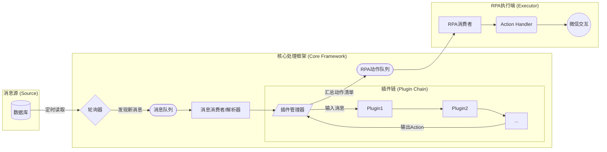

# 基础概念

## RPA
基于视觉识别的微信自动化操作，采用YOLO模型+OCR定位控件，实现零HOOK。

## 插件架构
通过插件系统扩展机器人功能，保持主逻辑清晰。

## MCP Tool
支持mcp调用rpa，和微信进行交互，发送消息，群管理操作等。

## 消息流转
- 数据库监听新消息
- 插件链处理消息
- RPA队列执行动作

## 架构图

```mermaid
graph LR
    subgraph "消息源 (Source)"
        direction LR
        DB[(数据库)]
    end
    subgraph "核心处理框架 (Core Framework)"
        direction TB
        Poller{轮询器} -->|发现新消息| MsgQueue([消息队列])
        MsgQueue --> Consumer[消息消费者/解析器]
        Consumer --> PluginManager[/插件管理器/]
        subgraph "插件链 (Plugin Chain)"
            PluginManager -->|输入消息| Plugin1
            Plugin1 --> Plugin2
            Plugin2 --> ...
        end
        ... -->|输出Action| PluginManager
        PluginManager --> |汇总动作清单| RPAQueue([RPA动作队列])
    end
    subgraph "RPA执行端 (Executor)"
        direction TB
        RPA_Consumer[RPA消费者] --> RPA_Handler(Action Handler)
        RPA_Handler --> WeChat((微信交互))
    end
    DB -- 定时读取 --> Poller
    RPAQueue --> RPA_Consumer
``` 